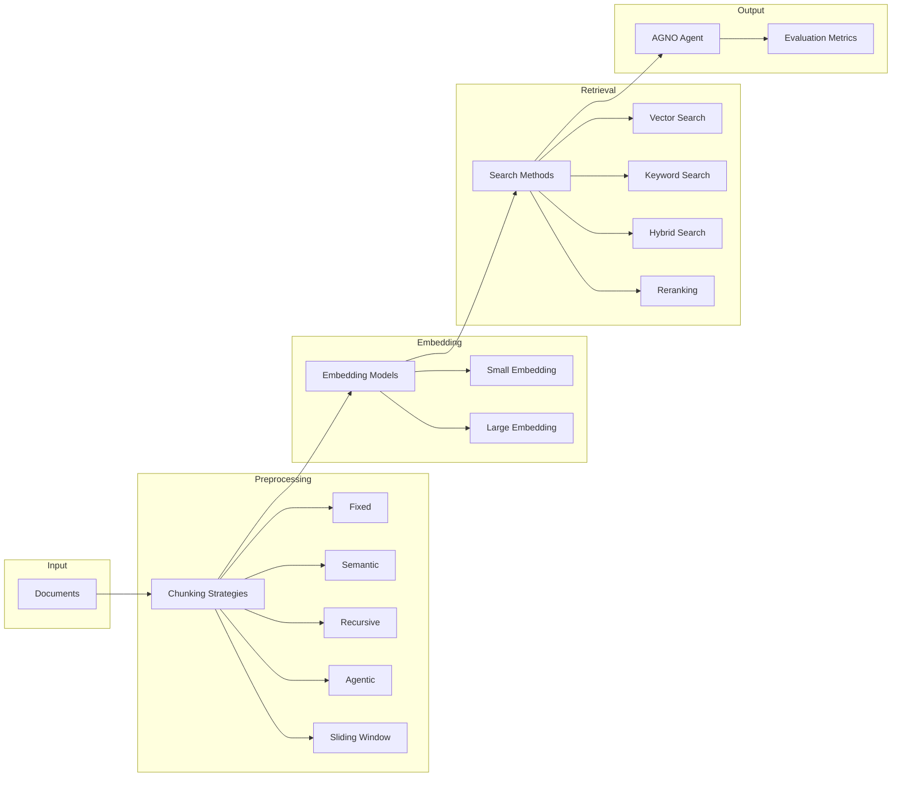

# Everyone’s Scaling Context Windows. Almost No One’s Fixing Retrieval.

Everyone is racing to make AI smarter.  
But what if the real problem isn’t reasoning, it’s *retrieval*?

Even the most advanced models stumble when their knowledge bases are fragmented or poorly structured.  
So instead of tuning prompts or scaling parameters, we looked deeper into how AI **stores**, **organizes**, and **recalls** what it knows.  

We ran a series of experiments across multiple knowledge-base configurations to answer one question:  
**How does the architecture of memory change the quality of AI understanding?**

---

## 🧩 Why We Did This

Every Retrieval-Augmented Generation (RAG) system depends on how knowledge is stored and retrieved.  
Most developers obsess over prompts and models, but the real leverage lies in the invisible layer underneath.  

We tested different combinations of chunking strategies, embeddings, and search modes to see which produced the most faithful and efficient retrieval.  
Each setup was challenged with **20–30 carefully designed questions** spanning definitions, multi-step reasoning, and real-world synthesis.

---

## ⚙️ What We Tried

Our experiments explored the full retrieval stack — from text segmentation to ranking precision.

### **Chunking Strategies**
We tested seven ways to split and structure text:
- **Fixed:** uniform token limits.  
- **Sliding Window:** overlapping chunks for better context continuity.  
- **Semantic:** meaning-based segmentation driven by topic similarity.  
- **Recursive:** hierarchy-preserving splits that follow document structure.  
- **Agentic:** uses a model to determine natural breakpoints in the text, analyzing content to find semantically meaningful boundaries like paragraph breaks and topic transitions.  
- **Separate:** clean, non-overlapping logical divisions to isolate topics.  
- **Document-level:** minimal splitting for full-context retrieval.

### **Embeddings**
We compared two embedding models:  
- **text-embedding-3-small** — lightweight and fast.  
- **text-embedding-3-large** — richer semantic precision for dense or technical text.

### **Search and Ranking**
We evaluated:
- **Vector Search:** semantic similarity only.  
- **Keyword Search:** literal term matching.  
- **Hybrid Search:** combines both for balanced precision and recall.  
- **Reranking:** re-orders top hits with a cross-encoder reranker for finer accuracy.

---
## 🧠 Architectural Overview

The diagram below summarizes the pipeline we evaluated across all configurations:

## 🔍 What We Learned

- **Hybrid retrieval** outperformed vector-only by 10–15% in factual accuracy.  
- **Semantic chunking** gave the best balance between coherence and recall, while **sliding windows** improved cross-page continuity.  
- **Larger embeddings** improved contextual understanding by ~4%, at a cost of 10–15% more latency.  
- **Reranking** tightened answer precision, especially for ambiguous questions.  
- **Agentic chunking** showed promise for reasoning-heavy tasks but increased processing time.

| Configuration | Accuracy | Latency | Strength |
|----------------|-----------|----------|-----------|
| Semantic + Large Embedder | 97–98% | +10–15% | Deep reasoning, technical text |
| Semantic + Small Embedder | 93–94% | baseline | Fast, balanced retrieval |
| Agentic Chunking | 89–91% | +20% | Adaptive reasoning |
| Hybrid Search + Reranker | +3–5% gain | slight delay | Improved ranking precision |

---

## 🔭 Closing Thought

Smarter AI doesn’t start with larger models, it starts with **better memory architecture**.  
How information is chunked, embedded, and retrieved determines how well an agent understands its world.  
Because in the end, intelligence isn’t just processing, it’s *remembering with purpose*.
